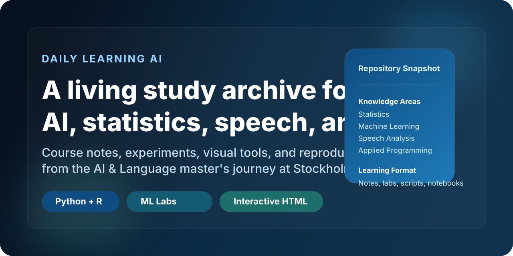
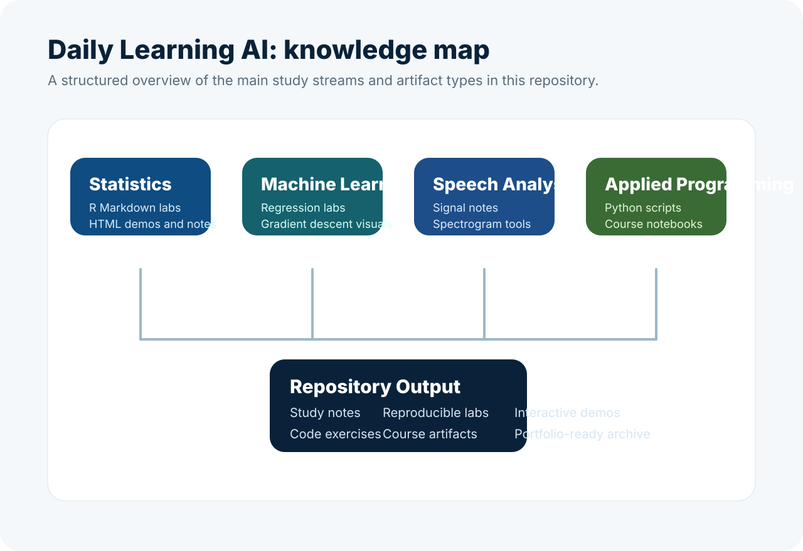

# Daily Learning AI



> A curated learning archive documenting my AI, statistics, speech analysis, and applied programming journey during the AI & Language master's program at Stockholm University.
>
> 这是一个持续更新的学习仓库，用来系统记录我在斯德哥尔摩大学 AI & Language 硕士阶段的课程学习、实验练习、代码实现和知识可视化过程。

## Overview

This repository is not a single app. It is a structured knowledge base built from day-to-day study materials:

- course notes and concept summaries
- reproducible lab work in Python and R Markdown
- interactive HTML learning tools and visual explainers
- small coding experiments in machine learning, signal analysis, and scientific programming

The goal is to turn fragmented coursework into a reusable, searchable, and portfolio-ready learning system.

## What This Repository Covers

| Area | Focus | Typical Artifacts |
| --- | --- | --- |
| [Statistics](./Statistics/) | descriptive statistics, inference, regression, categorical predictors | `.md`, `.Rmd`, `.html`, datasets |
| [Machine Learning](./Machine%20Learning/) | regression, resampling, clustering, gradient descent intuition | labs, notes, Python scripts, HTML visualizations |
| [Speech Analysis](./Speech%20Analysis/) | time-frequency analysis, auditory perception, spectrogram concepts | notes, JSX, HTML tools |
| [Applied Programming](./applied%20programming/) | NumPy, SciPy, sparse matrices, dimensionality reduction, backpropagation | Python scripts, lecture materials, notebook exports |
| [Python](./Python/) | syntax notes and language features | topic notes and mini examples |
| [Manim-test](./Manim-test/) | lightweight animation experiments | Python scenes |

## Featured Materials

- [Gradient Descent Visual Simulator](./Machine%20Learning/gradient%20descent/梯度下降可视化模拟器.html)
- [Time-Frequency Analysis Notes](./Speech%20Analysis/Time-Frequency%20Analysis.md)
- [Spectrogram Visualization Tool](./Speech%20Analysis/spectrogram%20可视化工具.html)
- [List Comprehension Notes](./Python/list-comprehension.md)
- [Backpropagation Notebook Export](./applied%20programming/lecture/18%20-%20Backpropagation.ipynb)
- [Multiple Regression Cost Function Script](./Machine%20Learning/regression%20model/compute_cost.py)

## Repository Snapshot



```text
Daily-Learning-AI/
├── Machine Learning/      # ML labs, regression notes, gradient descent, R Markdown work
├── Statistics/            # statistical notes, demos, HTML visualizations, R materials
├── Speech Analysis/       # speech science notes and interactive tools
├── applied programming/   # scientific programming exercises and lecture artifacts
├── Python/                # Python topic notes
├── Manim-test/            # animation experiments
└── assets/                # GitHub-facing visuals for project presentation
```

## Why I Built It This Way

- To make daily learning compounding rather than disposable
- To keep theory, code, and visualization in the same place
- To document progress in a way that is useful both for revision and for public portfolio presentation

Instead of treating coursework as isolated assignments, this repository organizes it as a long-term technical learning archive.

## Tech Stack

- Languages: Python, R, Markdown, HTML, JSX, Shell
- Tools: Git, Jupyter, Manim
- Topics: machine learning, statistics, speech analysis, scientific computing

## How To Browse This Repo

If you are visiting this repository for the first time, this path works best:

1. Start from the topic folders above.
2. Open the Markdown notes for concepts and summaries.
3. Explore the HTML files for interactive explanations and visual intuition.
4. Check the Python and R Markdown files for implementation details and lab practice.

## Current Direction

This repository is actively evolving toward a cleaner public-facing study archive with:

- more topic indexes
- better cross-linking between notes and code
- cleaner examples and reproducible experiments
- stronger GitHub presentation assets

## Author

**Leo Huang**

If you are also building an AI learning system from coursework, notes, and experiments, feel free to use this repository as inspiration for structuring your own knowledge base.
